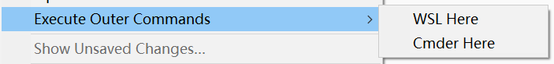

# ContextShellCommand
[ContextShellCommand](https://github.com/absop/ContextShellCommand) is a Sublime Text plugin, which support dynamic context menu (right-click menu).

By modifying the settings file, users can bind **external commands** to right-click menu items or shortcuts, so that the corresponding external commands can be executed easily with the right mouse button or shortcuts.


# Installation
This plugin depends on the [dctxmenu](https://github.com/absop/dctxmenu) plugin. Before installing this plugin, you must install `dctxmenu` plugin.

The following steps assume that you already have [Package Control](https://packagecontrol.io/) installed.

1. Copy the URL of this repository: <https://github.com/absop/ContextShellCommand>
2. Enter into Sublime Text, press down the shortcut <kbd>Ctrl+Shift+P</kbd> to enter into **Command Palette**
3. Input the command `pcar(Package Control: Add Repository)`
4. Press down the shortcut <kbd>Ctrl+V</kbd>, then <kbd>Enter</kbd>
5. Using **Package Control** to install this package
   1. Press down <kbd>Ctrl+Shift+P</kbd>
   2. Input `pcip(Package Control: Install Package)`
   3. Input `ContextShellCommand`


# Bind External Commands to The Right-click Menu
You can using the command palette to type and execute the command `Preferences ContextShellCommand Settings`, or click on the main menu (Preferences>Package Settings> ContextShellCommand >Settings), to begin editing the settings.

You can add a **menu sub-item** to the right-click menu by adding a **command-map** to the `commands` entry, which is one of the two setting entires of this plugin, the other is `caption`.

Here's an example
```json
{
    "caption": "Run Shell Cmd",

    "commands": [
        {
            "caption": "Github Desktop Here",
            "command": ["github.bat", "${file_path}"],
            "shell": true,
            // "show_output_panel": false
        },
        {
            "caption": "Cmder Here",
            "command": ["Cmder.exe", "${file_path}"],
            "shell": true,
            // "show_output_panel": false
        },
        {
            "caption": "List Files",
            "command": ["dir", "${file_path}"],
            "shell": true,
            "platform": "Windows",
            "encoding": "gbk"
        }
    ]
}
```
Where `commands` is a list of `command-map`s.

Each `command-map` is a dictionary (Dict, or Map), where `caption` is the title of the corresponding command displayed in the menu, and `command` is the specific command to be executed. Please refer to the above example to fill in carefully. `command` can be a string, or a list of strings, the strings of `command` can contain some variables (reference [Sublime Text API documentation](https://www.sublimetext.com/docs/api_reference.html#ver-dev), search `extract_variables`) and these variables will be replaced with their corresponding values when the command is executed.

In addition, `command-map` supports a optional argument called `shell` with a boolean value, which defaults to `true` and is passed to `subprocess` and is not normally used.

An entry in `commands` directly corresponds to a menu item. When there are multiple menu items, the menu will be folded and the folded menu will be titled with the value of the `caption` of the same level as `commands`. When there is only one `command-map` in `commands`, only one top-level menu is added to the right-click menu.

The following screen-shot shows the two menu sub-items were added to the right-click menu with using the example settings above.



# Binding Shortcuts
By editing your personal `keymap` file (Preferences>Key Bindings), you can also bind specific external commands to shortcuts, so that you can use shortcuts to execute external commands in Sublime Text. Here's an example
```json
{
    "keys": ["ctrl+alt+t"],
    "command": "execute_shell_command",
    "args": {
        "command": ["Cmder.exe", "\"${file_path}\""],
        "shell": true,
        // "show_output_panel": false
    }
}
```
You can copy this example and modify the `"keys"` and `"args"` entries. The value of `"args"` is a `command-map`, except that the `caption` entry will be ignored.
